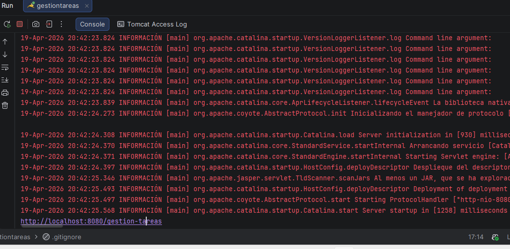
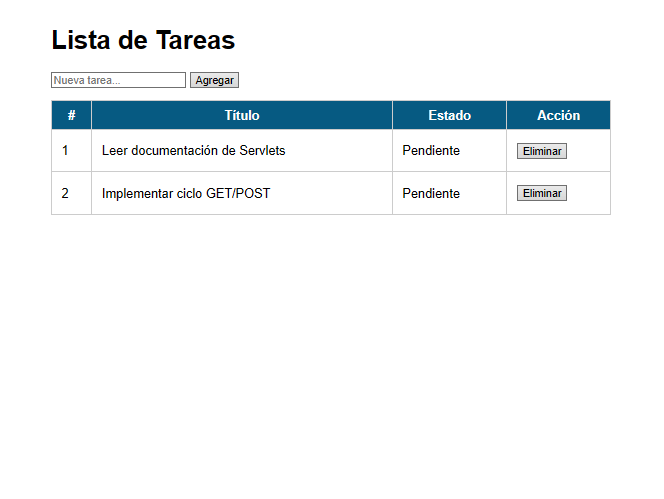
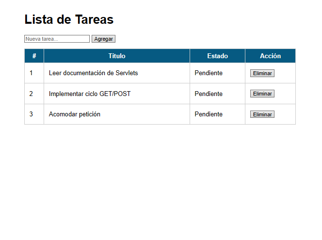
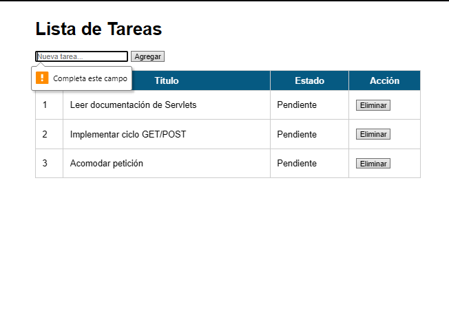
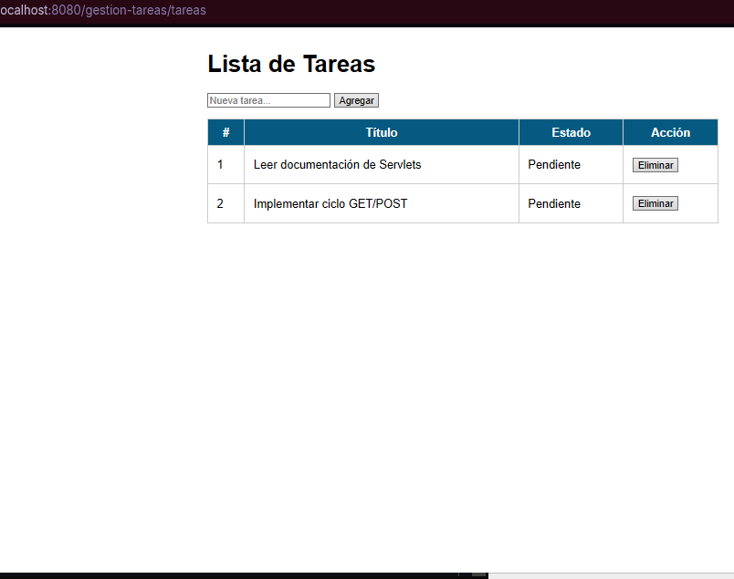

# Gestión de Tareas con Servlets y JSP

## Autor

- **Nombre:** Kevin Ramirez
- **Código:** 02220131008
- **Programa:** Ingeniería de Sistemas
- **Unidad:** 5 Fundamentos de Java Web
- **Actividad:** Post-Contenido 1
- **Fecha:** 20/04/2026

Aplicación web desarrollada en Java Web para la Unidad 5 de Programación Web. El proyecto implementa un `Servlet` que procesa solicitudes HTTP `GET` y `POST`, valida formularios en el servidor, reenvía información a una vista JSP mediante `RequestDispatcher` y aplica el patrón Post/Redirect/Get.

## Datos del proyecto

- `groupId`: `com.ejemplo`
- `artifactId`: `gestion-tareas`
- Java: `17`
- Empaquetado: `war`
- Servidor recomendado: `Apache Tomcat 10.x`

## Funcionalidades implementadas

- Listado de tareas existentes mediante `GET /tareas`
- Registro de nuevas tareas mediante `POST /tareas`
- Validación del título en el servidor
- Eliminación de tareas por `id` mediante `POST /tareas`
- Vista JSP ubicada en `WEB-INF/views/tareas.jsp`
- Redirección posterior al `POST` con el patrón PRG

## Estructura principal

```text
src/main/java/com/ejemplo/model/Tarea.java
src/main/java/com/ejemplo/servlet/TareasServlet.java
src/main/webapp/index.jsp
src/main/webapp/WEB-INF/web.xml
src/main/webapp/WEB-INF/views/tareas.jsp
```

## Requisitos

- JDK 17 o superior
- Maven 3.8 o superior
- Apache Tomcat 10.x
- IntelliJ IDEA o Eclipse

## Ejecución del proyecto

1. Clonar el repositorio.
2. Abrir el proyecto en IntelliJ IDEA como proyecto Maven.
3. Verificar que el SDK del proyecto esté configurado en Java 17.
4. Ejecutar el comando:

```bash
mvn clean package
```

5. Configurar un servidor Tomcat local en el IDE.
6. Desplegar el artefacto `gestion-tareas.war exploded`.
7. Abrir en el navegador:

```text
http://localhost:8080/gestion-tareas/tareas
```

## Flujo esperado

- Al ingresar a `/tareas`, se muestran 2 tareas de ejemplo cargadas en `init()`.
- Al agregar una tarea válida, el sistema redirige nuevamente a `/tareas`.
- Al enviar el formulario sin título, se muestra el mensaje `El título no puede estar vacío`.
- Al eliminar una tarea, esta desaparece de la tabla y se mantiene la URL `/tareas`.

## Evidencias

### Compilación del proyecto



### Lista inicial de las tareas



### Registro de nueva tarea



### Error de título vacío



### Eliminar tarea



## Checkpoint de verificación

- La aplicación compila sin errores con `mvn clean package`.
- La página muestra las dos tareas iniciales.
- El formulario agrega tareas correctamente y aplica PRG.
- La validación en servidor muestra el mensaje de error cuando el título está vacío.
- La eliminación de tareas funciona correctamente.
